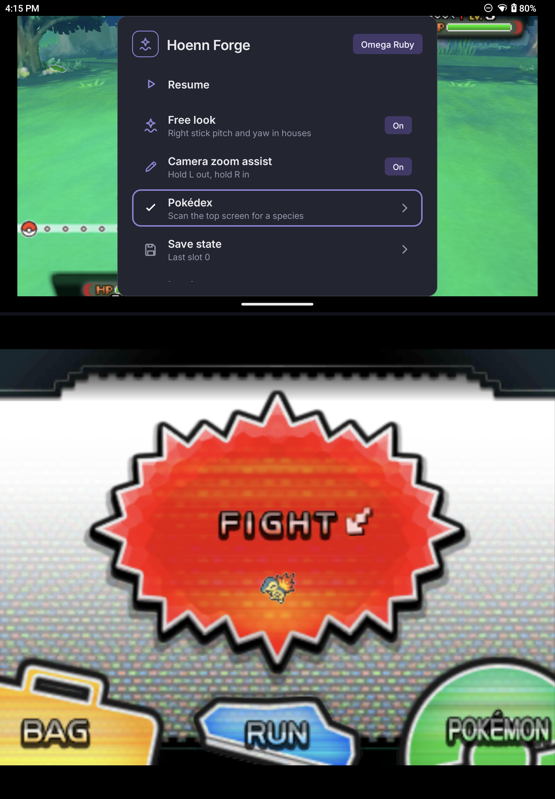
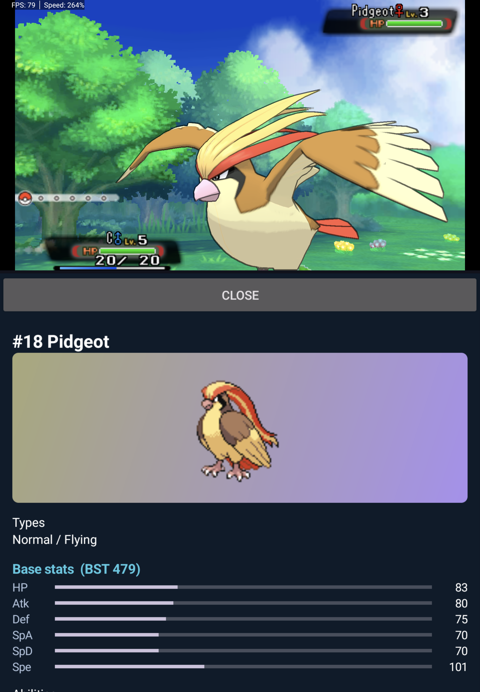
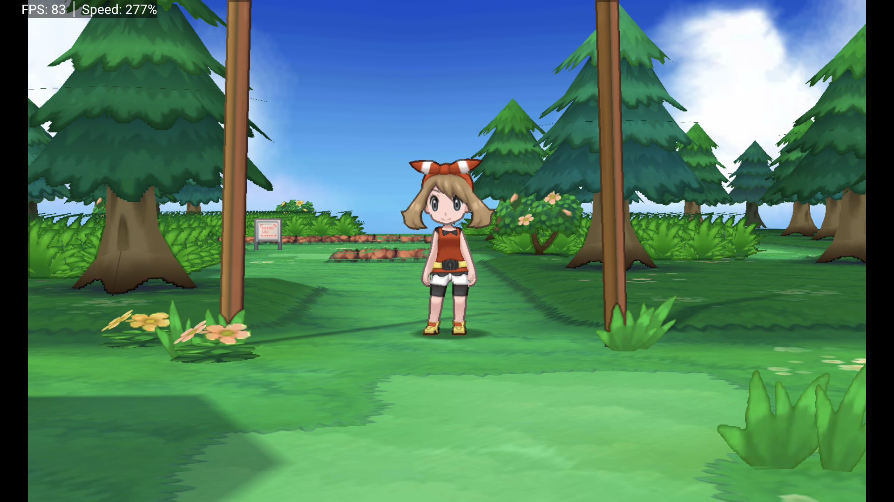
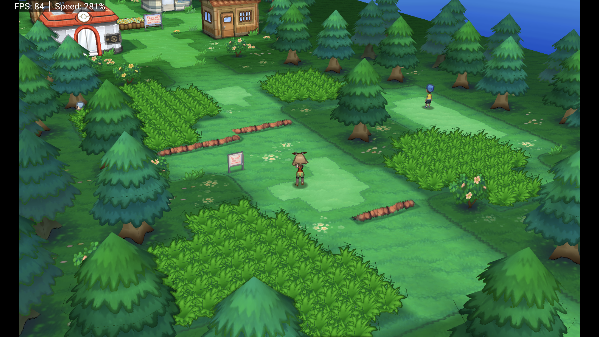
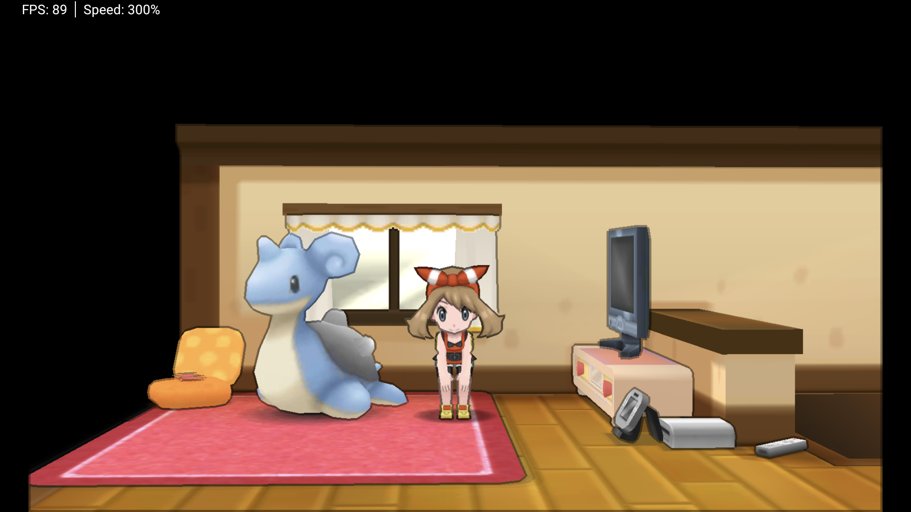

# Hoenn Forge

**Modern Pokémon Omega Ruby / Alpha Sapphire on Android** — especially the [AYN Thor](https://www.ayntec.com/) — as a single APK.

You bring a dump of a game you own. Hoenn Forge packages an Azahar-based 3DS core, Thor-tuned defaults, optional on-device randomizer, free look in houses, save states, turbo, and an offline Pokédex helper.

> **Unofficial fan project.** Not affiliated with Nintendo, Creatures Inc., GAME FREAK, or The Pokémon Company.  
> **This repository and the distributed app do not include any game ROMs, decryption keys, or copyrighted game binaries.** You must provide a dump of a game you own.

**Source:** [github.com/afterfinish/thor-hoenn-forge](https://github.com/afterfinish/thor-hoenn-forge)  
**Package ID:** `dev.tzigdon.hoennforge`  
**Latest release:** [alpha-0.1](https://github.com/afterfinish/thor-hoenn-forge/releases/tag/alpha-0.1)

---

## Screenshots

Dual-screen (AYN Thor) and freelook angles from dogfood:

| | |
|:--:|:--:|
|  |  |
| Dual screen | Dual screen |
|  |  |
| Free look | Free look |
|  | |
| Top screen (Littleroot) | |

---

## Features

### Onboarding & shell
- Guided legal-dump flow (pick your own `.3ds` / `.cci`)
- App data folder for saves, shaders, and LayeredFS mods (original dump is never written)
- Vanilla or randomized run preparation
- Dual-screen layout tuned for AYN Thor (top + bottom presentation)
- High internal resolution and performance defaults (Vulkan, async shaders, disk shader cache, accurate multiplication, nearest-neighbor upscale)

### Randomizer (optional)
- Seeded runs (same seed + same options → same run)
- Presets: Light / Standard / Chaos
- Modules inspired by pk3DS-class tools: wilds, trainers, starters, plus advanced personal/moves/evolutions/misc options
- Mods applied via LayeredFS under app storage — **your original dump is never modified**

### In-game (START quick menu)
- **Resume**
- **Free look** — right stick pitch/yaw in houses and many interiors (OR/AS; outdoor towns not supported in this release)
- **Camera zoom assist** — hold L to zoom out, R to zoom in
- **Pokédex** — OCR the top screen, match a species, show an offline entry (prefers the bottom display on Thor)
- **Save state / load state**

### Controls extras
- **L3 (left stick click)** — turbo toggle (temporary frame limit)
- Hardware gamepad preferred; START is claimed for the Hoenn menu (not the emulated 3DS Start button)

### Settings
- Display, Controls, Graphics, Randomizer, Data, and About summaries
- Escape hatch to the full advanced Azahar emulator UI when you need it

---

## Requirements

- Android **10+** (API 29+), arm64
- A **legally obtained** decrypted dump of Pokémon Omega Ruby or Alpha Sapphire (`.3ds` / `.cci`)
- Enough free storage for a working copy, shader cache, and optional randomized mods
- Dual displays optional; Thor dual AMOLED is the primary profile

---

## Getting started

1. Download **`HoennForge-alpha-0.1.apk`** from [Releases](https://github.com/afterfinish/thor-hoenn-forge/releases/tag/alpha-0.1) (or build from this tree).
2. Install on an arm64 Android 10+ device (AYN Thor recommended). Allow install from unknown sources if needed.
3. On first launch, choose an app data folder, then point at your dump.
4. Pick **vanilla** or a **randomized** run and wait for prepare to finish.
5. Play. **START** opens the quick menu; **L3** toggles turbo.

**Alpha note:** Prefer a **new in-game save** for clean testing. Avoid loading savestates made during earlier freeze sessions.

Do not open issues asking for ROMs, keys, or download links — they will be closed.

---

## Building

Full notes: [docs/building.md](docs/building.md).

Typical Android path (Azahar core + Hoenn overlay):

```powershell
cd C:\hoenn-forge
$env:JAVA_HOME = "C:\Program Files\Android\Android Studio\jbr"
$env:ANDROID_HOME = "$env:LOCALAPPDATA\Android\Sdk"
powershell -NoProfile -ExecutionPolicy Bypass -File scripts\build-android.ps1
```

Output APK (when using the overlay build script):

```text
dist\HoennForge-vanilla-relWithDebInfo.apk
```

Prerequisites: JDK 17+, Android SDK 35, NDK (as required by the Azahar Android tree), Git submodules under `emulator/azahar` initialized when building the core from source.

---

## Architecture

```text
APK (no game files)
├── Kotlin onboarding & Hoenn UI
├── On-device prepare / randomizer pipeline → LayeredFS
└── Azahar-based emulator core (Thor profile + freecam / zoom / turbo hooks)
```

Working contracts for maintainers and AI assistants live in [SOUL.md](SOUL.md). Session handoff is [MEMORY.md](MEMORY.md). Design and research docs are under [docs/](docs/).

---

## License

**Hoenn Forge** (this repository’s original code, overlay, scripts, and packaging) is licensed under the **GNU General Public License v3.0**. See [LICENSE](LICENSE).

The emulator core is based on **Azahar**, which is distributed under the **GNU General Public License v2** (or later, as indicated in upstream headers). Combining and distributing the APK requires GPL compliance: provide corresponding source for the complete work you ship.

Third-party libraries keep their own licenses (Apache-2.0, BSD, MIT, SIL OFL, etc.). See **Credits** and the notices shipped with each dependency (including Azahar’s tree under `emulator/azahar/`).

---

## Credits

Hoenn Forge stands on a large amount of open work. Verified projects and components used in this product:

### Emulator core
| Project | Role | License (upstream) | Link |
|---------|------|--------------------|------|
| **[Azahar](https://github.com/azahar-emu/azahar)** | 3DS emulator core (Android + native) forked/overlaid here | GPL-2.0 | [azahar-emu.org](https://azahar-emu.org/) |
| **[Citra](https://github.com/citra-emu/citra)** | Original open-source 3DS emulator lineage | GPL-2.0 | Historical Citra project |
| **[Lime3DS](https://github.com/Lime3DS/Lime3DS)** | Post-Citra continuation merged into Azahar | GPL-2.0 | Lime3DS project |
| **PabloMK7’s Citra fork** | Major post-Citra lineage merged into Azahar | GPL-2.0 | See Azahar history |

Azahar also vendors many native libraries (dynarmic, Crypto++, SDL lineage pieces where used, sound/video stacks, etc.). Their licenses live with those subtrees under `emulator/azahar/externals/` and Azahar’s own docs.

### Randomizer
| Project | Role | License | Link |
|---------|------|---------|------|
| **[pk3DS](https://github.com/kwsch/pk3DS)** (Kaphotics / kwsch and contributors) | Algorithms and formats informing the on-device randomizer (not the Windows EXE dropped into the APK) | GPL | [github.com/kwsch/pk3DS](https://github.com/kwsch/pk3DS) |

### Offline Pokédex
| Project | Role | License / note | Link |
|---------|------|----------------|------|
| **[PokeAPI](https://github.com/PokeAPI/pokeapi)** | Species / type data for `species.json` | BSD-3-Clause | [pokeapi.co](https://pokeapi.co/) |
| **[PokeAPI sprites](https://github.com/PokeAPI/sprites)** (community pack) | Offline UI icons under `assets/pokedex/sprites/` | Community redistributed icons; game art remains Nintendo’s — see `overlay/azahar/assets/pokedex/NOTICE.txt` | GitHub sprites repo |
| **[Google ML Kit](https://developers.google.com/ml-kit/vision/text-recognition)** Text Recognition | On-device OCR for the living Pokédex | Google terms / third-party notices for the dependency | ML Kit docs |

### UI & fonts
| Project | Role | License | Link |
|---------|------|---------|------|
| **[Inter](https://github.com/rsms/inter)** | UI typeface | SIL Open Font License 1.1 | rsms.me/inter |
| **[IBM Plex Mono](https://github.com/IBM/plex)** | Mono face for seeds / IDs | SIL Open Font License 1.1 | IBM Plex |

### Android libraries (direct)
| Project | Role | License | Link |
|---------|------|---------|------|
| **AndroidX** (Activity, AppCompat, Fragment, Lifecycle, Navigation, Preference, RecyclerView, Work, …) | App framework | Apache-2.0 | Android Jetpack |
| **[Material Components for Android](https://github.com/material-components/material-components-android)** | Material widgets / dialogs | Apache-2.0 | Google |
| **[Coil](https://github.com/coil-kt/coil)** | Image loading | Apache-2.0 | coil-kt |
| **[kotlinx.serialization](https://github.com/Kotlin/kotlinx.serialization)** | JSON | Apache-2.0 | Kotlin |
| **[java-string-similarity](https://github.com/tdebatty/java-string-similarity)** | Fuzzy name match for Pokédex OCR | MIT | info.debatty |
| **[ini4j](http://ini4j.sourceforge.net/)** | INI config helpers | Apache-2.0 | ini4j |

### Build / platform
| Project | Role | Note |
|---------|------|------|
| **[Vulkan Validation Layers](https://github.com/KhronosGroup/Vulkan-ValidationLayers)** (Khronos) | Optional/debug native layers pulled at build time | Apache-2.0 / Khronos licenses |
| **Android NDK / CMake / Gradle toolchain** | Native + APK build | Respective Google / Apache licenses |

### Inspiration (no code taken as a dependency)
- **Dusklight**-style “install → point at your dump → play modern”
- **OoT3D free-camera** community research as a freecam philosophy reference (house free look here is ORAS-specific memory work in this tree)

### Trademarks
Pokémon, Pokémon character names, and related marks are trademarks of Nintendo / Creatures Inc. / GAME FREAK. AYN and Thor are trademarks of their respective owners. This project is not endorsed by any of them.

---

## Contributing

1. Read **[SOUL.md](SOUL.md)** (legal and product non-negotiables).  
2. Check **[MEMORY.md](MEMORY.md)** for current handoff.  
3. Prefer small, reviewable changes. Preserve upstream license headers when touching Azahar-derived files.

**After meaningful changes:** commit, push to the public remote, and update `MEMORY.md` when that is part of your workflow.

---

## Name

**Hoenn Forge** — forge your own modern Hoenn run from a dump you own.
